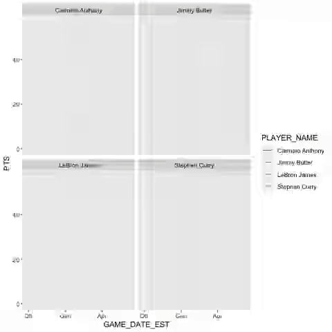
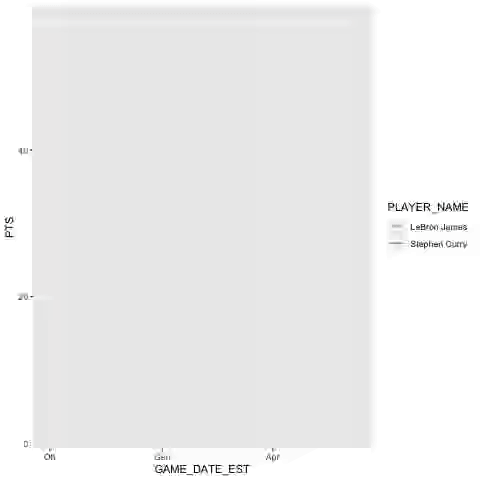
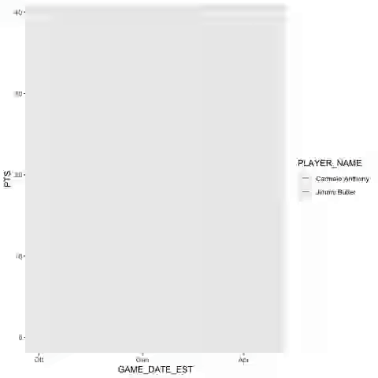

```{r setup, include=FALSE}
knitr::opts_chunk$set(cache = TRUE, message = FALSE, warning = FALSE)
library(readr)
library(dplyr)
library(ggplot2)
library(gganimate)
library(readr)
library(tidyr)
library(BasketballAnalyzeR) #Dati sulle percentuali di squadra e dei singoli giocatori della stagione 2017/2018
```

```{r, cache = FALSE,include=FALSE}
nbaplayers = read_csv("./Progetto-Data-Science/players.csv")
gamesdetail = read_csv("./Progetto-Data-Science/games_details.csv")
games = read_csv("./Progetto-Data-Science/games.csv")
teams = read_csv("./Progetto-Data-Science/teams.csv")
ranking = read_csv("./Progetto-Data-Science/ranking.csv")
```

## Introduzione
Il progetto che presento si basa su un argomento sportivo, nello specifico sul campionato americano di pallacanestro NBA, di fama mondiale a cui ogni giocatore di basket ambisce. 
In effetti i migliori giocatori della storia del basket sono emersi proprio attraverso la selettiva partecipazione a quest’ultimo.
L’idea di questo progetto è nata non solo per la passione da giocatore di basket, ma ovviamente anche come tifoso.


## Descrizione
Noteremo quattro grafici. Ogni grafico rappresenta un singolo giocatore. 
Gli atleti che ho selezionato per questo progetto sono: LeBron James, Steph Curry, Jimmy Butler e Carmelo Anthony.
Nella parte finale invece ho cercato di assemblare i dati per ottenere delle statistiche pratiche, cioè che possano servire realmente ad agenti o allenatori per esaminare i dati delle stagioni concluse e di conseguenza visualizzare i punti deboli da migliorare.


```{r, include = FALSE, cache = FALSE}
#Cercare l'id di un giocatore tramite nome
nbaplayers %>% 
  filter(grepl('Carmelo', PLAYER_NAME)) %>%
  select(PLAYER_ID, PLAYER_NAME)

#Creiamo una tabella con i dati che ci interessano
giocatorecompleto = gamesdetail %>% 
  filter(PLAYER_ID == "2544")%>%
  select(PLAYER_NAME, MIN, PTS)

#Calcolare quanti punti totali ha fatto un giocatore
res <- sum(giocatorecompleto$PTS, na.rm = TRUE)
res

#Calcolare media punti di un giocatore
mediacanestri = mean(giocatorecompleto$PTS, na.rm = TRUE)
mediacanestri

#Creazione tabelle
datipartita = inner_join(gamesdetail, games)
datisquadra = teams %>% 
  select(TEAM_ID, ABBREVIATION)
prova5 = inner_join(datipartita, datisquadra)

giocatorestagione = prova5 %>% 
  filter(PLAYER_ID == "2544", SEASON == "2017")%>%
  select(PLAYER_NAME, MIN, PTS, SEASON, ABBREVIATION, GAME_DATE_EST )

giocatorecompleto1 = prova5 %>% 
  filter(PLAYER_ID == "2544" ) %>%
  select(PLAYER_NAME, MIN, PTS, SEASON, ABBREVIATION, GAME_DATE_EST)

confronto4 = prova5 %>% 
  filter(PLAYER_ID == "2544"|PLAYER_ID == "201939"|PLAYER_ID == "202710"|PLAYER_ID == "2546", SEASON == "2017") %>%
  select(PLAYER_NAME, MIN, PTS, SEASON, ABBREVIATION, GAME_DATE_EST)
```

## RMarkdown
Una piccola spiegazione di ogni parte del codice verrà posta sopra di esso. Una spiegazione più dettagliata verrà fatta oralmente.


## Punti per stagione
Quindi, per iniziare, ho creato un grafico che rappresenta il numero delle partite a parità di punteggio realizzate dal giocatore in una stagione. 
Per esempio: in questo grafico possiamo notare che LeBron James nella stagione 2017/2018 ha giocato 4 partite realizzando 30 punti ciascuna.
 

```{r}
#Grafico punti per stagione
ggplot(data = confronto4) +
  geom_freqpoly(mapping = aes(x = PTS), binwidth = 0.4)+
  facet_wrap(~PLAYER_NAME)
```


## Punti per carriera
Procedimento simile può essere fatto per rappresentare tutta la carriera del giocatore, utilizzando però un altro tipo di grafico, di più facile lettura con numeri più visibili rispetto a quello precedente.
Anche in questo caso si può verificare approsimativamente la media che il giocatore ha avuto in tutta la sua carriera.

```{r}
#Grafico punti carriera
confronto2 = prova5 %>% 
  filter(PLAYER_ID == "2544"|PLAYER_ID == "201939"|PLAYER_ID == "202710"|PLAYER_ID == "2546") %>%
  select(PLAYER_NAME, MIN, PTS, SEASON, ABBREVIATION, GAME_DATE_EST)

ggplot(data = confronto2) +
  geom_bar(mapping = aes(x = PTS))+
  facet_wrap(~PLAYER_NAME)

```


## Punti stagione per minuti
Ho voluto rappresentare anche il punteggio realizzato in base ai minuti giocati.
In questo caso possiamo notare un corretto andamento del grafico verso l’alto (come la logica ci porta a pensare), ma non è scontato che sia sempre così.
Un'altra informazione che possiamo dedurre dal grafico è che, prendendo in considerazione ad esempio Lebron James, durante la stagione 2017/2018 ha giocato molte partite rimanendo in campo per 35/40 minuti.

```{r}
#Grafico punti per minuti giocati
ggplot(data = confronto4) +
  geom_point(mapping = aes(x = MIN, y = PTS))+
  facet_wrap(~PLAYER_NAME)
```


## Punti carriera con relativa squadra
Un altro tipo di grafico è nato dalla curiosità di vedere quale fosse stata la stagione con più punti segnati di alcuni giocatori. Ho deciso di utilizzare variabili di colore così da individuare sia l’anno più proficuo, sia la squadra nella quale il giocatore ha militato in quella stagione.

```{r}
#Grafico punti carriera con relativa squadra
ggplot(confronto2, aes(x = SEASON, y = PTS, fill = ABBREVIATION)) +
  geom_bar(stat="identity")+
  facet_wrap(~PLAYER_NAME)
```


## Partite carriera con relativa squadra
Rimanendo sullo stesso modello di grafico, in questo caso vediamo quante partite sono state disputate dai vari giocatori selezionati per ogni stagione.
Il numero di partite giocate rappresentate nel grafico può variare per molteplici fattori, il principale è sicuramente la presenza o meno del giocatore alla fase dei play-off e cioè all'ultima parte della stagione in cui vengono ammesse solo 16 squadre. LeBron James ad esempio nella stagione 2018/2019 non ha partecipato ai play-off e lo possiamo notare nel grafico dalle poche partite giocate.

```{r}
#Grafico partite carriera con relativa squadra
ggplot(data = confronto2) +
  geom_bar(mapping = aes(x = SEASON, fill = ABBREVIATION))+
  facet_wrap(~PLAYER_NAME)
```


## Punti per giornata
Analizziamo adesso un grafico animato che rappresenta i punti fatti nell'arco di ogni partita, per una singola stagione da ognuno dei quattro giocatori che ho selezionato.
Ho scelto di rappresentare una singola stagione per rendere più comprensibile l'andamento del grafico.

```{r}
graph2 = ggplot(confronto4, aes(x = GAME_DATE_EST, y = PTS, color = PLAYER_NAME)) +
  geom_line()+
  facet_wrap(~PLAYER_NAME)

graph2.animation = graph2 +
  transition_reveal(GAME_DATE_EST)

#gif_cars = animate(graph2.animation)
#gif_cars

```



## Confronto giocatori per punti giornata
Una volta che abbiamo visionato i punteggi realizzati dai singoli giocatori possiamo farne un confronto abinato.
Quindi andando ad analizzare il grafico vediamo in quali momenti della stagione il giocatore è stato più performante dell’avversario.
Ho scelto di analizzare e mettere a confronto Stephen Curry con Lebron James e Jimmy Butler con Carmelo Anthony, poiché in quella determinata stagione Stephen Curry e Lebron James sono arrivati entrambi alla finale NBA come migliori realizzatori della propria squadra.
```{r}
#Animazione grafico punti stagione steph vs lebron
confronto = prova5 %>% 
  filter(PLAYER_ID == "2544"|PLAYER_ID == "201939", SEASON == "2017") %>%
  select(PLAYER_NAME, MIN, PTS, SEASON, ABBREVIATION, GAME_DATE_EST)

graph3 = ggplot(confronto, aes(x = GAME_DATE_EST, y = PTS, color = PLAYER_NAME)) +
  geom_line()

graph3.animation = graph3 +
  transition_reveal(GAME_DATE_EST)

#gif_cars = animate(graph3.animation)
#gif_cars
```


```{r}
#Animazione grafico punti stagione Jimmy vs Carmelo
confronto = prova5 %>% 
  filter(PLAYER_ID == "2546"|PLAYER_ID == "202710", SEASON == "2017") %>%
  select(PLAYER_NAME, MIN, PTS, SEASON, ABBREVIATION, GAME_DATE_EST)

graph4 = ggplot(confronto, aes(x = GAME_DATE_EST, y = PTS, color = PLAYER_NAME)) +
  geom_line()

graph4.animation = graph4 +
  transition_reveal(GAME_DATE_EST)

#gif_cars = animate(graph4.animation)
#gif_cars
```


## Statistiche squadra
A conclusione di questo progetto, la ricerca si fa più dettagliata.
Il grafico qui raffigurato rappresenta sull'ascissa la percentuale di tiri da due realizzati mentre sull'ordinata troviamo la percentuale dei tiri da tre realizzati.
A questo punto notiamo che le squadre collocate in alto a destra hanno realizzato molto sia da due che da tre.
Invece in basso a sinistra quelle squadre che hanno avuto delle percentuali di tiri realizzati veramente basse.

```{r}
#Statistiche squadre (la grandezza sono i punti)
str(Tbox)
data <- data.frame(Tbox[,c(1, 4, 9, 12, 15, 16)])
labs <- c("% tiri da 2 realizzati",
          "% tiri da 3 realizzati",
          "% tiri liberi realizzati",
          'Punti')

bubbleplot(data, id="Team", 
           x="P2p", 
           y="P3p", 
           col="FTp",
           size = 'PTS',
           labels=labs)


#Statistiche squadre (la grandezza sono gli assist)
str(Tbox)
data <- data.frame(Tbox[,c(1, 9, 12, 15)],
                   APS = Tbox$AST / (Tbox$P2A + Tbox$P3A + Tbox$FTA))
labs <- c("% tiri da 2 realizzati",
          "% tiri da 3 realizzati",
          "% tiri liberi realizzati",
          'Assist per tentativi')

bubbleplot(data, id="Team", 
           x="P2p", 
           y="P3p", 
           col="FTp",
           size = 'APS',
           labels=labs)

```


## Statistiche giocatori
Utilizzando lo stesso tipo di grafico poi ho voluto vedere nel dettaglio le percentuali di tiro di alcuni giocatori facenti parte di una singola squadra. 
In questo caso ho scelto come esempio i Golden State Warriors.

```{r}
#Statistiche giocatori 
str(Pbox)
data <- Pbox
data <- subset(Pbox, Team =="Golden State Warriors" & MIN>=500)
data <- data.frame(data[, c(1, 2, 5, 8, 11, 14)])
labs <- c("% tiri da 2 realizzati",
          "% tiri da 3 realizzati",
          "% tiri liberi realizzati",
          'Punti')
bubbleplot(data, id="Player", 
           x="P2p", 
           y="P3p", 
           col="FTp",
           size="PTS",
           labels=labs)  
```


## Confronto statistiche giocatori
Infine in questo grafico, simile al precedente, ho voluto mettere a confronto la percentuale di tiro dei giocatori di due squadre.

```{r}
#Statistiche giocatori confronto 1
str(Pbox)
data <- Pbox
data <- subset(Pbox, Team =="Golden State Warriors" & MIN>=500 | Team =="Cleveland Cavaliers" & MIN>=500)
data <- data.frame(data[, c(1, 2, 5, 8, 11, 14)])
labs <- c("% tiri da 2 realizzati",
          "% tiri da 3 realizzati",
          "% tiri liberi realizzati",
          'Punti')
bubbleplot(data, id="Player", 
           x="P2p", 
           y="P3p", 
           col="FTp",
           size="PTS",
           text.col = "Team",
           labels=labs)


#Statistiche giocatori confronto 2
str(Pbox)
data <- Pbox
data <- subset(Pbox, Team =="Boston Celtics" & MIN>=800 | Team =="Phoenix Suns" & MIN>=800)
data <- data.frame(data[, c(1, 2, 5, 8, 11, 14)])
labs <- c("% tiri da 2 realizzati",
          "% tiri da 3 realizzati",
          "% tiri liberi realizzati",
          'Punti')
bubbleplot(data, id="Player", 
           x="P2p", 
           y="P3p", 
           col="FTp",
           size="PTS",
           text.col = "Team",
           labels=labs)
```


